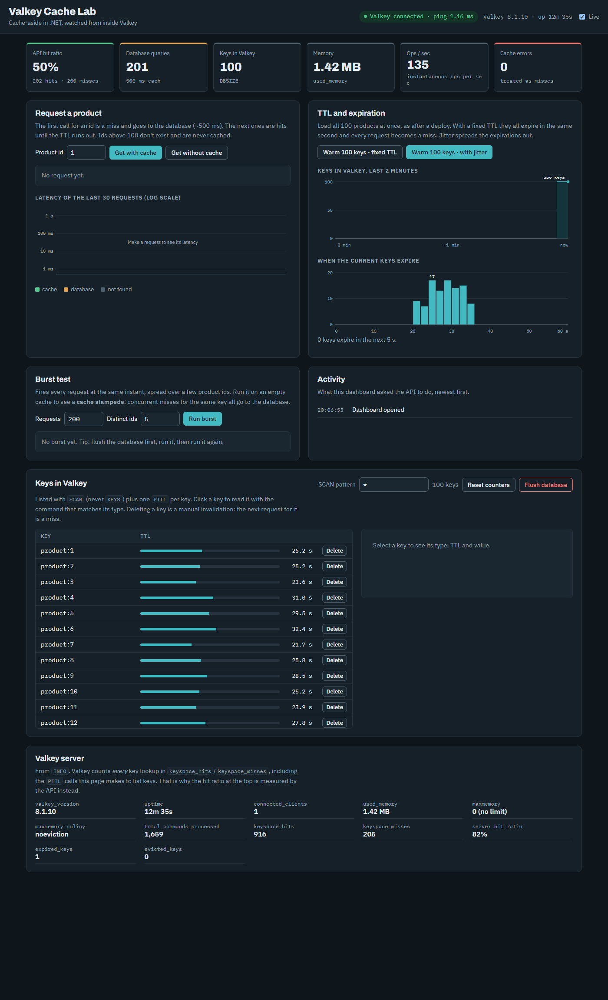
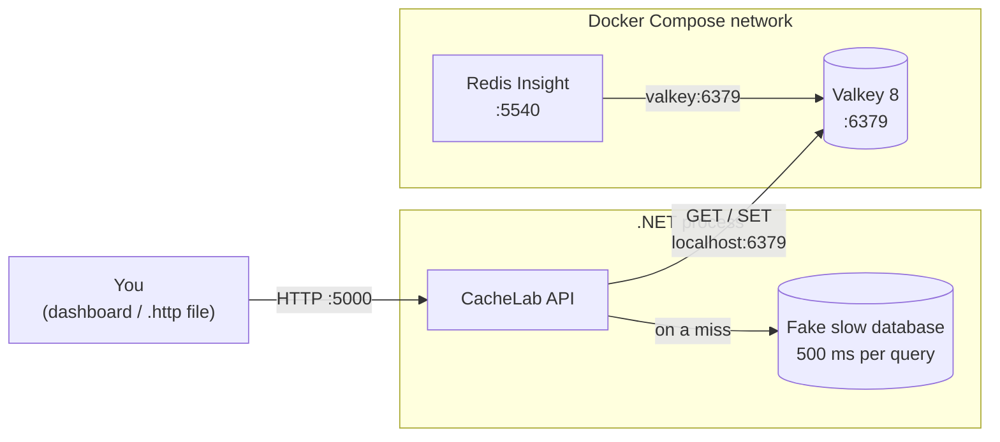
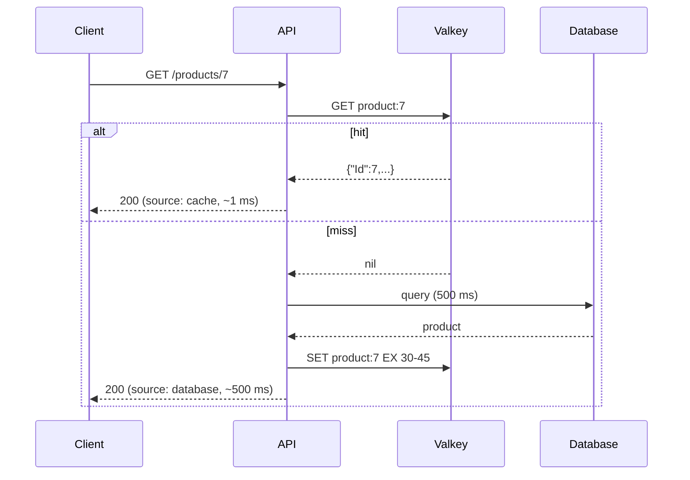

# Valkey Cache Lab

A hands-on lab for learning how caching works, built with .NET and [Valkey](https://valkey.io/).

It's a small API with a deliberately slow fake database and a Valkey cache in front of it. A browser dashboard lets you watch keys, TTLs and server stats change live. Every stage is meant to be run and observed: see the latency drop, watch keys expire, take the cache down, and trigger a cache stampede on purpose.



## What you'll see

| Scenario | Result measured in the lab |
|---|---|
| Product lookup straight from the database | ~500 ms |
| Same lookup served from Valkey | ~1–2 ms |
| Valkey stopped while the API is running | API still answers from the database in ~0.5 s (it hung for ~12 s before the fix) |
| 200 simultaneous requests for 5 products on a cold cache | 200 database queries (a cache stampede) |
| The same burst on a warm cache | 0 database queries, p50 of 6 ms |

## Why Valkey?

Valkey is an open-source (BSD) fork of Redis 7.2. It was created in 2024, when Redis moved away from the BSD license, and is maintained under the Linux Foundation. It speaks the same wire protocol (RESP), so existing clients and tools work unchanged. This lab uses `StackExchange.Redis` and Redis Insight against Valkey without any Valkey-specific code.

## Architecture



The API runs on your machine, outside Docker, so it reaches Valkey at `localhost:6379`. Redis Insight runs inside the Compose network, where containers find each other by service name, so it connects to `valkey:6379`.

## Cache-aside

The API uses the **cache-aside** (lazy loading) pattern. The application decides everything; Valkey only stores and returns what it's given.



The logic lives in [`ProductService`](CacheLab/ProductService.cs). The HTTP endpoint and the burst test both call it, so the burst measures the same code that serves requests.

## Getting started

### Prerequisites

- [.NET SDK 8](https://dotnet.microsoft.com/download) or later
- Docker. On Windows, Docker Desktop must be in **Linux containers** mode. The Valkey and Redis Insight images are Linux-only, and Windows mode fails with `no matching manifest for windows/amd64`.

### Run

```bash
# 1. Start Valkey and Redis Insight
docker compose up -d

# 2. Start the API on http://localhost:5000 (Development environment)
cd CacheLab
dotnet run
```

Then open **http://localhost:5000** for the dashboard. You can also use the requests in [`CacheLab.http`](CacheLab/CacheLab.http) from Visual Studio or VS Code, or call the API from a terminal:

```powershell
irm http://localhost:5000/products/1   # miss: ~500 ms, source = database
irm http://localhost:5000/products/1   # hit:  ~1 ms,   source = cache
irm http://localhost:5000/stats
```

Redis Insight is available at http://localhost:5540. Add a database with host `valkey` and port `6379`.

## The dashboard

The dashboard is plain HTML, CSS and JavaScript served from [`wwwroot`](CacheLab/wwwroot), with no build step. It is only enabled in the **Development** environment, because it can read every key and wipe the database.

- **Request a product:** calls the API with and without the cache, explains the hit or miss, and plots latency on a log scale so 1 ms and 500 ms fit on one chart.
- **TTL and expiration:** warms 100 keys with a fixed TTL or with jitter. It charts the key count over the last two minutes and a histogram of when each key expires.
- **Burst test:** fires N requests at the same instant to show a cache stampede.
- **Keys in Valkey:** lists keys with `SCAN` and shows TTLs counting down. Clicking a key reads it with the command that matches its type (`GET`, `HGETALL`, ...). You can delete a key (manual invalidation) or flush the database.
- **Valkey server:** selected fields from `INFO`.

> **Why two hit ratios?** Valkey counts *every* key lookup in `keyspace_hits` / `keyspace_misses`, including the `TTL` and `TYPE` commands. The `PTTL` calls the dashboard makes to list keys inflate the server's ratio: in the lab, the server reported 82% while the API measured 50%. The headline number is the one counted by the API.

## API

| Endpoint | Description |
|---|---|
| `GET /products/{id}` | Cache-aside lookup |
| `GET /products/{id}/no-cache` | Always hits the database (baseline) |
| `POST /cache/warm?jitter=true\|false` | Loads all 100 products at once, simulating a post-deploy warm-up |
| `GET /stats` | Database queries plus cache hits, misses, errors and hit ratio |
| `POST /stats/reset` | Resets the counters |
| `GET /health` | Pings Valkey. Returns `healthy`, or `degraded` while Valkey is down (still HTTP 200) |

Development only:

| Endpoint | Description |
|---|---|
| `GET /` | The dashboard |
| `GET /valkey/info` | `INFO` fields and `DBSIZE` |
| `GET /valkey/keys?pattern=*` | Keys (via `SCAN`) with their remaining TTL |
| `GET /valkey/key?key=...` | Type, TTL and value of one key |
| `DELETE /valkey/key?key=...` | Deletes a key |
| `POST /valkey/flush` | `FLUSHDB` |
| `POST /lab/burst?requests=200&distinctIds=5` | N simultaneous lookups through the cache-aside code |

## Design decisions

| Decision | Why |
|---|---|
| A single `ConnectionMultiplexer` (singleton) | Connections are expensive. The multiplexer is thread-safe and pipelines commands from all requests over one socket, the same lesson as `HttpClient`. |
| Fake database with `Task.Delay(500)` | Predictable latency and a query counter prove how often the cache spared the database, with no Postgres to set up. |
| Products stored as JSON strings | Products are always read and written whole. A hash pays off when you read or update individual fields, as with sessions. |
| `entity:id` key names (`product:7`) | This is the community convention. It works with `SCAN MATCH product:*` and shows up as a folder tree in Redis Insight. |
| Every key has a TTL | A key without an expiry stays stale forever if invalidation fails. |
| Up to +50% TTL jitter | Keys written together would otherwise expire together and send every miss to the database in the same second (cache avalanche). |
| Cache failures are treated as misses | The cache is an optimization, not the source of truth. [`ValkeyCache`](CacheLab/ValkeyCache.cs) logs connection errors, timeouts and bad JSON, then falls back to the database. |
| `abortConnect=false` | The API starts even when Valkey is down and reconnects in the background. |
| `BacklogPolicy.FailFast` | By default the client queues commands while disconnected, which made each request hang for ~12 s. Failing fast turns an outage into a quick miss. |
| `asyncTimeout=1000` | A slow Valkey costs a request at most one second. |
| `/health` reports `degraded` with HTTP 200 | The API still works without the cache. Returning 503 would make a load balancer pull healthy instances out of rotation. |
| `allowAdmin=true` only in `appsettings.Development.json` | `FLUSHDB` is an admin command. It's blocked by default and only enabled for the lab. |
| `SCAN`, never `KEYS` | Valkey runs one command at a time. `KEYS` walks the whole keyspace in one go and blocks every other client. |

## Project structure

```
.
├── docker-compose.yml          # Valkey 8 (with healthcheck) + Redis Insight
└── CacheLab/
    ├── Program.cs              # DI, Valkey connection, public endpoints
    ├── ProductService.cs       # Cache-aside logic
    ├── ValkeyCache.cs          # Fail-safe cache wrapper with hit/miss/error stats
    ├── CacheOptions.cs         # TTL and jitter settings (validated at startup)
    ├── ProductRepository.cs    # Fake slow database (100 products, 500 ms per query)
    ├── LabEndpoints.cs         # Development-only inspection and burst endpoints
    ├── wwwroot/                # Dashboard (index.html, app.css, app.js)
    ├── CacheLab.http           # Ready-to-run requests
    └── appsettings*.json       # Connection string and cache settings
```

## Configuration

`appsettings.json`:

```json
{
  "ConnectionStrings": {
    "Valkey": "localhost:6379,abortConnect=false,connectTimeout=2000,asyncTimeout=1000"
  },
  "Cache": {
    "TtlSeconds": 30,
    "JitterRatio": 0.5
  }
}
```

Any value can be overridden with environment variables, for example `ConnectionStrings__Valkey` when running the API in a container.

## Roadmap

- [x] **0. Environment:** Valkey and Redis Insight with Docker Compose
- [x] **1. Valkey basics:** `SET`/`GET`, `TTL`, `INCR`, hashes, `SET NX`, `SCAN`, `INFO`, `MONITOR`
- [x] **2. Cache-aside:** a .NET API with a slow database, from ~500 ms to ~1 ms
- [x] **2b. Resilience:** the cache goes down and the API stays up
- [x] **3. TTL and jitter:** avoiding the cache avalanche
- [x] **Dashboard:** keys, TTLs, bursts and server stats in the browser
- [ ] **4. Invalidation:** update a price and see the cache serve the old one, then compare delete-on-write, write-through and key versioning
- [ ] **5. Stampede, penetration and hot keys:** a `SET NX` lock and negative caching
- [ ] **6. Memory and eviction:** `maxmemory` with LRU, LFU and `noeviction`
- [ ] **7. Beyond caching:** rate limiting, leaderboards, pub/sub
- [ ] **8. Persistence and replication:** RDB, AOF and replicas
- [ ] **Finally:** compare with .NET's `IDistributedCache` and `HybridCache`
